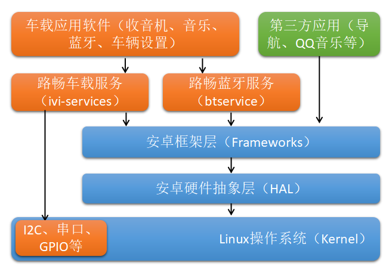

路畅科技安卓软件平台 Roadrover IVI SDK使用说明
==============================================

一、背景介绍
------------
设计初衷是轻系统、重应用，对SOC和Android的版本依赖减到最少，方便快速地切换SOC和安卓版本。操作系统层面只提供基本的标准接口比如I2C、GPIO、串口、摄像头驱动等。
在应用层上运行一个叫Roadrover IVI的APK，里面有多个Service在跑，负责车辆相关、蓝牙设备、音频设备、收音机设备等的封装，同时提供SDK让其他UI应用可以方便地使用这些服务。

软件架构组成




二、SDK概述
------------
SDK的输出形式为aar库，也可以通过附带的源代码编译，开发工具选择Android Studio 2.0以上版本。Roadrover IVI Service APK随系统提供（没有UI，只有Service）


三、一般使用说明
----------------
一般每个功能都有相应的Manager，比如RadioManager、IVIAudioManager、CarManager等等，Manager负责和service通过AIDL通信，将相应的功能接口封装起来便于应用来调用。

除了Manager外，各个功能还有相应的常量定义、常用函数类，来帮助应用很好地使用Mananger，比如IVIAudio、IVIRadio、AudioParam、IVICar、Climate等等

一般Manager的使用流程（在Activity或者Service里面）是
```java
BaseManager.ConnectListener mConnectListener = new BaseManager.ConnectListener() {
    @Override
    public void onServiceConnected() {
        //服务连接上了，可以对Manager进行各种操作
        ...
    }

    @Override
    public void onServiceDisconnected() {
    }
};

public void onCreate() {
    ...
    /**
    * 第一个参数是Context
    * 第二个参数一般是ConnectListener，来得到服务是否连接上的回调，一般在onServiceConnected里面进行初始化，可以传入null
    * 第三个参数一般是各个Manager特有的Listener，来得到服务的消息通知，可以传入null，然后通过EventBus来接收消息，下面有说明
    * Manager的构造函数会自动调用connect来连接服务
    */
    mXXXManager = new XXXManager(this, mConnectListener, this);
    ...
}

public void onDestroy() {
    ...
    mXXXManager.disconnect();
    ...
}
```
Service各种参数的获取，可以在当服务连接上后直接调用Manager的接口来获取，也可以通过EventBus或者回调来获取参数变化

**使用接口：**

    boolean frontLeftDoor = mCarManager.isDoorOpen(IVICar.Door.Id.FRONT_LEFT);  //获取前左车门状态

**使用EventBus：**

Manager在new的时候最后一个参数可以传入null，然后使用EventBus来获取参数变化的通知，比如想获取车门信息，就创建CarManager，在如下代码中获取车门信息，**好处是可以放在代码任何地方，且只处理感兴趣的部分**
```java    
public void onCreate() {
    ...
    // 注册EventBus消息接收
    EventBus.getDefault().register(this);
    mCarManager = new CarManager(this, this, null);
    ...
}

public void onDestroy() {
    ...
    // 反注册EventBus消息接收
    EventBus.getDefault().unregister(this);
    mCarManager.disconnect();
    ...
}

@Subscribe(threadMode = ThreadMode.MAIN)
public void onDoorChanged(IVICar.Door door) {
    // 刷新车门的UI
    updateDoor();
}
```

**使用回调：**

实现回调函数，缺点是必须实现所有的回调函数，包括应用不感兴趣的函数（当然函数内容可以为空）。所有的回调函数因为在Manager内部已经使用EventBus中转了，都是UI线程安全的，**可以在回调函数里面刷新UI**
```java
CarManager.CarListener mCarListener = new CarManager.CarListener() {
    ...
    @Override
    public void onDoorChanged(int changeMask, int statusMask) {
        // 刷新车门的UI
        updateDoor();
    }
    ...
}

mCarManager = new CarManager(this, mConnectListener, mCarListener);
```

四、收音机
----------
所有频率的单位都是KHz

**接口函数：**
```java
// 打开设备
void open();

// 关闭设备
void close();

// 设置频率
void setFreq(int freq);

// 获取当前频率
int getFreq();

// 设置波段（AM、FM），值在IVIRadio.Band里面定义
void setBand(int band);

// 设置 区域 值在IVIRadio.Location里面定义
void setLocation(int location);

// 上搜索 freqStart 搜索的起始位置
void scanUp(int freqStart);

// 下搜索 freqStart 搜索的起始位置
void scanDown(int freqStart);

// 全局搜索
void scanAll();

// 停止搜索
void scanStop();

// 向上/下调一步频率 direction 1:向上，-1：向下
void step(int direction);
```
**回调函数：**
```java
public interface RadioListener {
    // 收音机频率发生变化
    void onFreqChanged(int freq);

    // 搜台结果signalStrength为0，该频率为无效电台，非0为有效电台的信号强度，可以对结果进行排序
    void onScanResult(int freq, int signalStrength);  

    // 搜台结束  
    void onScanEnd(boolean isScanAll);        

    // 刷新信号强度          
    void onSignalUpdate(int freq, int signalStrength);
}
```
**EventBus函数：**    
```java
@Subscribe(threadMode = ThreadMode.MAIN)
public void onFreqChanged(IVIRadio.EventFreqChanged event) {
}

@Subscribe(threadMode = ThreadMode.MAIN)
public void onScanResult(IVIRadio.EventScanResult event) {
}

@Subscribe(threadMode = ThreadMode.MAIN)
public void onScanEnd(IVIRadio.EventScanEnd event) {
}

@Subscribe(threadMode = ThreadMode.MAIN)
public void onSignalUpdate(IVIRadio.EventSignalUpdate event) {
}
```


五、音量条和音频设置
--------------------
**音量条的显示（触摸按键入口）：**

    SystemUI检测到音量加减的按键消息 -> 
    SystemUI调用IVIAudioManager的onTouchKey函数，传入按键值 -> 
    AudioService将音量改变 -> 
    AudioService通过VolumeBarListener回调函数onShowVolumeBar通知SystemUI ->
    SystemUI根据回调弹出音量条

**音量条的显示（方控按键入口）：**

    CarService收到方控音量加减按键消息 -> 
    AudioService将音量改变 -> 
    AudioService通过VolumeBarListener回调函数onShowVolumeBar通知SystemUI ->
    SystemUI根据回调弹出音量条

**音量条的显示（浮动窗口入口）：**

    浮动窗口调用IVIAudioManager的showVolumeBar函数 ->
    AudioService通过VolumeBarListener回调函数onShowVolumeBar通知SystemUI ->
    SystemUI根据回调弹出音量条

**音量条的更新（通过按键）：**
    和音量条的显示流程相同

**音量条的更新（音频通道发生变化，比如播放媒体时来了电话）：**
    AudioService通过VolumeBarListener回调函数onShowVolumeBar通知SystemUI ->
    SystemUI根据回调刷新音量条

**音量条的更新（通过进度条拖动）：**
    SystemUI调用IVIAudioManager的setParam函数改变音量值 ->
    SystemUI自行刷新进度条，此时没有onShowVolumeBar的回调

**音量条的隐藏（超时）：**

    SystemUI调用IVIAudioManager的hideVolumeBar函数(此时SysetemUI可以先自行隐藏音量条) ->
    AudioService通过VolumeBarListener回调函数onHideVolumeBar通知SystemUI ->
    SystemUI隐藏音量条

**音量条的隐藏（浮动窗口入口）：**

    浮动窗口调用IVIAudioManager的hideVolumeBar函数 ->
    AudioService通过VolumeBarListener回调函数onHideVolumeBar通知SystemUI ->
    SystemUI隐藏音量条


六、媒体回调流程解析
--------------------
```java
public interface MediaControlListener {
    /**
     * 挂起媒体
     * 在蓝牙电话开始、Power键锁屏、声控开启的时候调用，
     * 媒体如果是在播放状态就暂停播放，如果是在暂停状态就不处理
     */
    void suspend();

    /**
     * 停止媒体
     * 在其他apk内的媒体（包括第三方媒体）打开的时候会被调用，断ACC超过一定的时间也会被调用
     */
    void stop();

    /**
     * 恢复媒体
     * 蓝牙电话结束、Power键结束锁屏，ACC恢复的时候调用，
     * 媒体恢复到suspend或者stop调用前的状态
     */
    void resume();


    /**
     * 暂停播放
     * 效果和UI上的暂停按钮相同，一般用于方控
     */
    void pause();

    /**
     * 开始播放
     * 效果和UI上的播放按钮相同，一般用于方控
     */
    void play();

    /**
     * 设置自有媒体音量
     * 一般在有导航提示音的时候调用
     */
    void setVolume(float volume);

    /**
     * 下一曲
     * 一般方控或者声控调用
     */
    void next();

    /**
     * 上一曲
     * 一般方控或者声控调用
     */
    void prev();

    /**
     * 选择播放列表里面的指定歌曲
     * 一般声控调用
     */
    void select(int index);

    /**
     * 收藏当前曲目
     * 一般声控调用
     */
    void setFavour(boolean isFavour);
    void filter(String title, String singer);
    void playRandom();
    void setPlayMode(int mode);

    /**
     * 退出当前应用
     */
    void quitApp();
}
```


七、多区媒体相关
--------------------
一些项目，比如宇通大巴，分为乘客区和司机区，有各自的媒体和声音逻辑，相关接口如下：  
MediaManager 中的函数

**void setMediaZone(int mediaType, int zone)**    
用来选择媒体声音输出区，必须在open媒体后之后才起作用

**int getMediaZone(int mediaType)**    
获取媒体声音输出区

**void openMediaInZone(int mediaType, int zone)**  
打开媒体，双区媒体专用，该函数和普通的open不同，如果zone和目前的zone不冲突，则会新打开一个媒体，已经打开的媒体不会关闭;如果zone冲突，则会关闭相同zone上的媒体普通的open函数无论如何都会关闭前一个媒体。  
例子：已经打开了MP3，且zone设置为MASTER，再打开Video（使用openMediaInZone, zone传入SECONDARY)，video就会和MP3共存；如果打开Video的时候传入ALL或者MASTER，则MP3的媒体就会被关闭

**int getMediaFromZone(int zone)**
得到双区媒体某个区域的媒体

**双DAC机型**  
如果硬件有2个DAC，则可以支持MP3和Video共同出声音，此时如果打开MP3的媒体类型为IVIMedia.Type.MUSIC，则打开Video的媒体类型就必须为IVIMedia.Type.VIDEO_DAC2，表示使用第二个DAC；如果打开MP3使用的是IVIMedia.Type.MUSIC_DAC2，则打开Video就必须传入IVIMedia.Type.VIDEO。  
媒体类型带DAC2的，必须设置AudioTrack的Stream为系统定义好的代表第二通道的Stream，比如是10。
不带DAC2的机型或者使用默认DAC的，Stream就是STREAM_MUSIC

RadioManager 中对应的函数  
int getZone(int zone);  
void setZone(int zone);  
void openInZone(int zone);   

七、蓝牙服务相关
--------------------
蓝牙服务有一个单独的apk，ivi-btservice.apk，开机服务自启动  
BluetoothManager     
蓝牙模块的接口类，所有调用回调，全部通过 IBluetoothCallback 回调通知，不直接返回       
由于执行指令全部在线程中执行，不直接返回执行结果     

interface IBluetooth {  

    /**
     * 获取蓝牙的版本
     */
    void getBluetoothVer(IBluetoothExecCallback callback);  

    /**
     * 打开蓝牙模块
     */
    int openBluetoothModule(IBluetoothExecCallback callback);  

    /**
     * 重置蓝牙模块
     */
    void resetBluetoothModule(IBluetoothExecCallback callback);  

    /**
     * 关闭蓝牙模块
     * @param moduleid 蓝牙模块id
     */
    void closeBluetoothModule(IBluetoothExecCallback callback);  

    /**
     * 获取蓝牙模块的状态
     */
    void getBluetoothModuleStatus(IBluetoothStatusCallback callback);  

    /**
     * 修改模块名字
     * @param moduleid 模块id
     * @param newName 新名字
     */
    void modifyModuleName(String newName, IBluetoothExecCallback callback);  

    /**
     * 修改模块 pin 码
     * @param moduleid 模块id
     * @param newPin 新 pin 码
     */
    void modifyModulePIN(String newPin, IBluetoothExecCallback callback);  

    // AVRCP控制指令 boolean sendAVRCPCommand(int moduleid, int command);  
    /**
     * 下一曲
     * @param moduleid 模块id
     */
    void nextBtMusic(IBluetoothExecCallback callback);  

    /**
     * 上一曲
     * @param moduleid 模块id
     */
    void prevBtMusic(IBluetoothExecCallback callback);  

    /**
     * 播放，暂停
     * @param moduleid 模块id
     */
    void playAndPause(IBluetoothExecCallback callback);  

    /**
     * 播放蓝牙音乐
     */
    void playBtMusic(IBluetoothExecCallback callback);  

    /**
     * 暂停蓝牙音乐
     */
    void pauseBtMusic(IBluetoothExecCallback callback);  

    /**
     * 停止音乐
     */
    void stopBtMusic(IBluetoothExecCallback callback);  

    /**
     * 获取蓝牙音乐 id3 信息，数据直接通过 onBtMusicId3Info 回调返回  
     */
    void getBtMusicId3Info(IBluetoothExecCallback callback);  

    /**
     * 设置蓝牙音量的百分比
     * @param volume 音量百分比
     */
    void setBtMusicVolumePercent(float volume, IBluetoothExecCallback callback);  
    // AVRCP控制指令结束

    /**
     * 连接指定设备
     * @param moduleid 模块id
     * @param addr 目标设备地址
     */
    void linkDevice(String addr, IBluetoothExecCallback callback);  

    /**
     * 断开设备，断开HFP，同时会断开A2DP
     * @param moduleid 模块id
     */
    void unlinkDevice(IBluetoothExecCallback callback);  

    /**
     * 删除指定设备
     * @param moduleid 模块id
     * @param addr 设备地址
     */
    void deleteDevice(String addr, IBluetoothExecCallback callback);  

    /**
     * 从蓝牙列表中删除所有设备
     */  
    void deleteAllDevice(IBluetoothExecCallback callback);  

    /**
     * 改变音量，增加音量
     * @param moduleid
     */
    void addVolume(IBluetoothExecCallback callback);  

    /**
     * 降低音量
     * @param moduleid
     */
    void delVolume(IBluetoothExecCallback callback);  

    /**
     * 静音蓝牙模块
     * @param isMute 是否静音
     */
    void muteBluetoothModule(boolean isMute, IBluetoothExecCallback callback);  

    /**
     * 拨打电话
     * @param moduleid
     * @param phnum 电话号码
     */
    void callPhone(String phnum, IBluetoothExecCallback callback);  

    /**
     * 重拨指令
     */
    void recallPhone(IBluetoothExecCallback callback);  

    /**
     * 挂断电话
     */
    void hangPhone(IBluetoothExecCallback callback);  

    /**
     * 来电拒接
     */
    void rejectPhone(IBluetoothExecCallback callback);  

    /**
     * 来电接听
     */
    void listenPhone(IBluetoothExecCallback callback);  

    /**
     * 语音拨号指令
     */
    void voiceDial(IBluetoothExecCallback callback);  

    /**
     * 语音切换，切换手机接听还是车机接听
     */
    void transferCall(IBluetoothExecCallback callback);  

    /**
     * 等待接听，该接口暂时无用
     */
    void waitCall(int type, IBluetoothExecCallback callback);  

    /**
     * 发送按键指令
     * @param moduleid
     * @param code 按键值，对应IVIBluetooth.BluetoothDTMFCode 中的定义  
     */
    void requestDTMF(int code, IBluetoothExecCallback callback);  

    /**
     * 静掉mic,连续调用会在静音和解静音之间进行操作
     */
    void muteMic(boolean isMute, IBluetoothExecCallback callback);  

    /**
     * 获取设备电量
     */  
    void getDeviceBattery(IBluetoothExecCallback callback);  

    /**
     * 获取信号强度
     * @param moduleid
     */
    void getDeviceSignalStrength(IBluetoothExecCallback callback);  

    /**
     * 获取蓝牙状态，状态会通过回调通知
     */
    void getBluetoothState(IBluetoothLinkDeviceCallback callback);  

    /**
     * 连接A2DP
     * @param isConnected 是否连接
     */
    void requestA2DPConnect(boolean isConnected, IBluetoothExecCallback callback);  

    /**
     * 连接上一个设备, 连接HFP协议
     * @param isConnected 是否连接
     */
    void requestHFPConnect(boolean isConnected, IBluetoothExecCallback callback);  

    /**
     * 设置蓝牙的监听回调
     */
    void requestBluetoothListener(in IBluetoothCallback listener);  

    /**
     * 注销蓝牙的监听回调
     */
    void unrequestBluetoothListener(in IBluetoothCallback listener);  

    /**
     * 获取蓝牙电话本，结果通过callback返回
     * @param moduleid 模块id
     */
    void getPhoneContacts(IBluetoothVCardCallback callback);  

    /**
     * 获取已接通话记录，结果通过callback回调返回
     * @param moduleid 模块id
     * @param callback 回调
     */
    void getReceivedCallRecord(IBluetoothVCardCallback callback);  

    /**
     * 下载已播的通话记录，结果通过callback回调返回
     */
    void getDialedCallRecord(IBluetoothVCardCallback callback);  

    /**
     * 获取未接的通话记录
     */
    void getMissedCallRecord(IBluetoothVCardCallback callback);  

    /**
     * 获取所有的通话记录
     */
    void getAllCallRecord(IBluetoothVCardCallback callback);  

    /**
     * 获取查找的设备的总数
     * @param moduleid 模块id
     */
    void getSearchedDeviceNum(IBluetoothExecCallback callback);  

    /**
     * 获取查找的设备的名字
     * @param moduleid 模块id
     * @param sequence 设备序列号
     */
    void getSearchedDeviceName(int sequence, IBluetoothExecCallback callback);  

    /**
     * 获取查找的设备地址
     * @param moduleid 模块id
     * @param sequence 设备序列号
     */
    void getSearchedDeviceAddr(int sequence, IBluetoothExecCallback callback);  

    /**
     * 搜索设备
     * @param moduleid 蓝牙模块id
     * @param devicetype 设备类型
     * @param callback 通过该接口获取数据
     */
    void searchNewDevice(int devicetype, ISearchDeviceCallback callback);  

    /**
     * 获取已经配置的设备列表
     * @param moduleid 蓝牙模块id
     * @param devicetype 设备类型
     * @param callback 通过该接口获取数据
     */
    void getPairedDevice(int devicetype, IDeviceCallback callback);  

    /**
     * 获取当前设备的设备名
     * @param moduleid 模块id
     */
    void getCurrentDeviceName(IBluetoothExecCallback callback);  

    /**
     * 获取当前设备的设备地址
     * @param moduleid 模块id
     */
    void getCurrentDeviceAddr(IBluetoothExecCallback callback);  

    /**
     * 获取蓝牙的名字，异步获取，结果通过 callback 回调返回
     * @param callback
     */
    void getBluetoothName(IBluetoothExecCallback callback);  

    /**
     * 获取蓝牙名字，同 getBluetoothName 方法，同步获取
     */
    String getBluetoothDeviceName();  

    /**
     * 获取蓝牙的pin码，异步获取，结果通过 callback 回调返回
     * @param callback
     */
    void getBluetoothPin(IBluetoothExecCallback callback);  

    /**
     * 获取蓝牙pin码，同 getBluetoothPin 方法
     */
    String getBluetoothDevicePin();  

    /**
     * 停止当前命令
     */
    void stopCurrentCommand();  

    /**
     * 第三方通话控制
     * @param action {@link com.roadrover.sdk.bluetooth.IVIBluetooth.ThreePartyCallCtrl}
     * @param callback
     */
    void threePartyCallCtrl(int action, IBluetoothExecCallback callback);  

    /**
    * 打开蓝牙
    */
    void powerOn();  

    /**
    * 关闭蓝牙
    */
    void powerOff();  

    /**
     * 设置蓝牙铃声音量
     * @param percent 0.0f 最小，1.0f最大
     */
    void setRingVolume(float percent);

    /**
    * 设置蓝牙音乐静音
    */
    void muteBtMusic(boolean isMute, IBluetoothExecCallback callback);

    /**
     * 是否已经配对
     * @param address 地址：
     */
    boolean isAlreadyPaired(String address);  

    /**
     * 配对请求 </br>
     * 判断地址，如果和已经连接的手机地址相同直接返回，否则要断开蓝牙连接，等待配对</br>
     */
    boolean pairingRequest(String address);  

    /**
     * 打开录音 </br>
     * 调用该接口后，会将通话声音录下来 </br>
     * <b>lr181蓝牙模块才支持该接口，录音到的文件保存在 /data/goc/下面 </br>
     * mic原始音频 : audio_prim.pcm </br>
     * 处理后音频 : audio_proc.pcm </b></br>
     */
    void openRecording(IBluetoothExecCallback callback);  

    /**
     * 关闭录音
     */
    void closeRecording(IBluetoothExecCallback callback);  
} 

